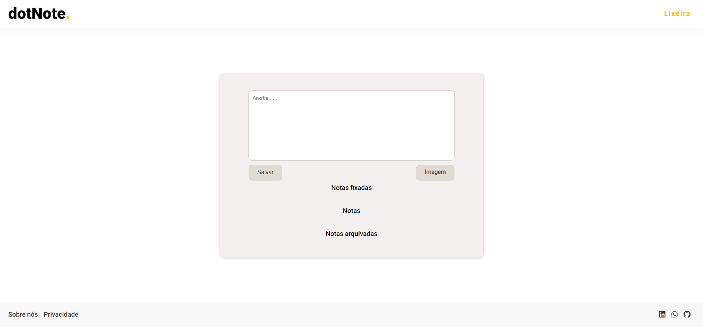
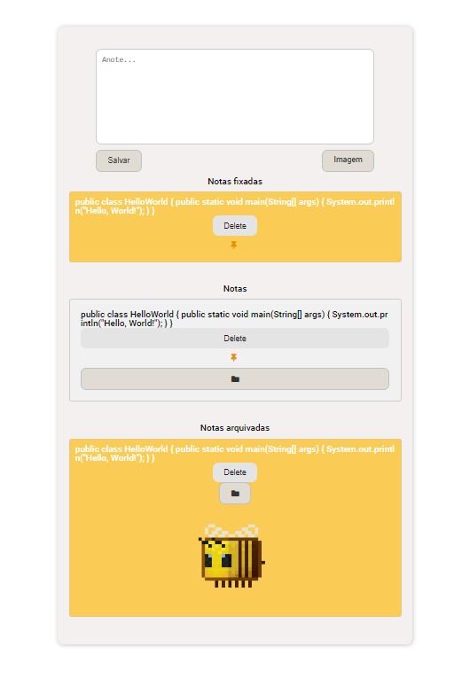
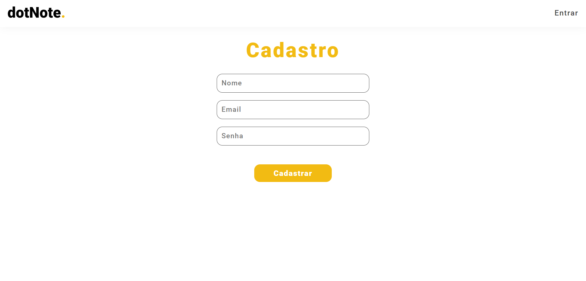
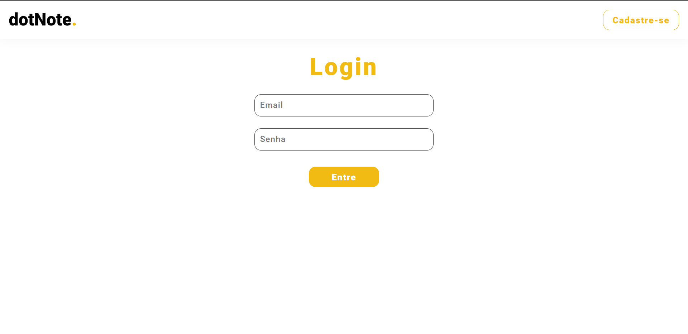

# DOTNOTE.🐝🍯
DOTNOTE. is a sample project that demonstrates the basic functionality of a system for creating, reading, updating, and deleting notes (CRUD). In this system, it is possible to create users inside firebase, realtimeDataBase.

## Functionalities
- User creation
- Creating notes
- Reading existing notes
- Updating existing notes (pinning and archiving)
- Delete existing notes

## Technologies 
- HTML
- CSS
- JAVASCRIPT
- FIREBASE (REALTIMEDATABASE)
- NODE

## Usage
- Note Creation: The createNoteElement function is responsible for creating a new note element based on user input. It creates a div element with the class "note" and appends various components to it, such as note content, images, delete button, pin button, and archive button.
- Image Handling: The handleImageSelect function is triggered when the user selects images. It reads the selected files, creates img elements, and displays the selected images within the note element.
- Clipboard Paste: The handlePaste function is called when the user pastes content into the note input field. It retrieves the pasted text and files from the clipboard data and creates a new note element based on the content.
- Note Actions: The code includes functionality to handle note actions such as pinning, archiving, and deleting notes. When the pin or archive button is clicked, the note element is moved to the corresponding container, and the button's display is updated accordingly. When the delete button is clicked, the note element is removed from its container.

- Firebase Integration: The code imports the Firebase SDK and initializes the Firebase app with the provided configuration. It also interacts with the Firebase Firestore database to store and retrieve user data.
- User Authentication: The code includes functionality for user authentication using email and password. It includes event listeners for a login form and a registration form. The validateUser function checks if the provided email and password match a user's data stored in the Firestore database.
- Notifications: The code includes a showNotification function to display success or error messages to the user. It creates a notification element and appends it to the DOM, then removes it after a certain period.

## Contributing
Contributions to this project are welcome. If you encounter any issues or want to add new features, feel free to submit a pull request.

## Author
If you have any questions or suggestions about the DOTNOTE project, feel free to contact me:
- Name: Isabela Ferreira Da Silva
- Email: [0800isabelaferreira@gmail.com](mailto:0800isabelaferreira@gmail.com)
- Discord username: isabelaffarago#7754
